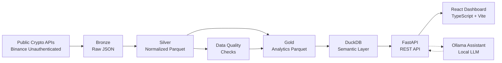

# AI-Native Crypto Trading Data Lakehouse

> A production-quality, local-first portfolio project showcasing senior data engineering, trading-data infrastructure, lakehouse design, data quality controls, APIs, React dashboards, and local LLM-powered analytics.

## Why This Project Exists

This project demonstrates the full stack of modern data platform engineering in the crypto/trading domain:
- **Medallion architecture** (bronze/silver/gold) on local filesystem
- **Data quality framework** with severity levels and actionable breaks
- **DuckDB semantic layer** over Parquet files
- **FastAPI backend** with typed endpoints
- **React + TypeScript dashboard** with real-time charts
- **Local LLM assistant** (Ollama) for natural-language analytics
- **Zero paid services** -- everything runs locally with free/open-source tooling

Ideal portfolio project for:
- Data Platform Engineer
- Trading Systems Engineer
- Quant Data Engineer
- FinTech / Crypto Backend Engineer
- AI Data Infrastructure Engineer

## Architecture



## Medallion Architecture

| Layer | Purpose | Format | Location |
|-------|---------|--------|----------|
| **Bronze** | Raw API payloads, immutable | JSON | `data/lakehouse/bronze/` |
| **Silver** | Normalized, validated, typed | Parquet | `data/lakehouse/silver/` |
| **Gold** | Analytics-ready metrics | Parquet | `data/lakehouse/gold/` |

### Data Flow

1. **Ingest**: Fetch klines/candles from Binance public endpoints (no auth required)
2. **Bronze**: Save raw JSON with metadata (source, endpoint, symbol, interval, ingestion_time)
3. **Silver**: Parse, validate, and transform into typed Parquet with partitioning
4. **Quality**: Run checks for duplicates, nulls, invalid prices, stale data, outliers
5. **Gold**: Compute daily/intraday metrics, portfolio NAV, exposures, drawdowns
6. **Serve**: DuckDB views expose data to FastAPI, which serves the React dashboard

## Local Setup

### Prerequisites

- Python 3.11+
- Node.js 18+
- (Optional) Ollama for LLM assistant

### Quick Start

```bash
# Clone and enter
cd crypto-lakehouse

# Install Python dependencies
make install

# Seed demo data, ingest, transform, and run quality checks
make demo

# Start the API server
make api

# In another terminal, start the frontend
make frontend
```

### Individual Commands

```bash
make install      # Install Python + Node dependencies
make seed         # Seed demo portfolio data
make ingest       # Ingest fresh market data from Binance
make silver       # Transform bronze -> silver
make gold         # Build gold-layer metrics
make quality      # Run data quality checks
make api          # Start FastAPI server (localhost:8000)
make frontend     # Start React dev server (localhost:5173)
make test         # Run pytest
make demo         # Full pipeline: seed + ingest + silver + gold + quality
make clean        # Remove generated data
```

## Example API Calls

```bash
# Health check
curl http://localhost:8000/health

# List supported assets
curl http://localhost:8000/assets

# Get candle data
curl "http://localhost:8000/market/candles?symbol=BTCUSDT&interval=1h&limit=200"

# Get daily metrics
curl "http://localhost:8000/analytics/daily-metrics?symbol=BTCUSDT"

# Get portfolio exposures
curl http://localhost:8000/portfolio/exposures

# Get quality breaks
curl http://localhost:8000/quality/breaks

# Ask the assistant (requires Ollama)
curl -X POST http://localhost:8000/assistant/ask \
  -H "Content-Type: application/json" \
  -d '{"question": "Which asset had the highest 7-day volatility?"}'
```

## Example Assistant Questions

- "Which asset had the highest volatility?"
- "Show me stale price breaks."
- "What changed in portfolio NAV?"
- "Which asset had the largest daily return?"
- "Show me the 7-day moving average for ETH."

## Free / Local-First Design Choices

| Component | License | Why |
|-----------|---------|-----|
| Binance public endpoints | Free (no auth) | Market data is publicly accessible |
| DuckDB | MIT | Fast, embedded, columnar analytics |
| FastAPI | MIT | Modern, typed, async Python API |
| React | MIT | Industry-standard frontend |
| Polars | MIT | Fast DataFrame library |
| Ollama | MIT | Local LLM runtime |
| Qwen3 | Apache 2.0 | High-quality open model |

**Intentionally excluded**: OpenAI, Gemini, Anthropic, AWS, GCP, Azure, Snowflake, Databricks -- all require paid accounts or API keys.

See [docs/FREE_COMPONENTS.md](docs/FREE_COMPONENTS.md) for details.

## Project Structure

```
crypto-lakehouse/
  README.md
  LICENSE
  .gitignore
  .env.example
  docker-compose.yml
  pyproject.toml
  Makefile

  backend/
    app/
      main.py
      api/
        routes_health.py
        routes_assets.py
        routes_market_data.py
        routes_quality.py
        routes_analytics.py
        routes_assistant.py
      core/
        config.py
        logging.py
      data/
        binance_client.py
        lake_paths.py
        bronze_writer.py
        silver_transform.py
        gold_metrics.py
        duckdb_repo.py
        quality_checks.py
        seed_portfolio.py
      assistant/
        ollama_client.py
        schema_context.py
        sql_guard.py
        templates.py
      models/
        api_models.py
    tests/
      test_quality_checks.py
      test_sql_guard.py
      test_gold_metrics.py

  frontend/
    package.json
    index.html
    src/
      main.tsx
      App.tsx
      api/client.ts
      components/
        DashboardLayout.tsx
        MarketOverview.tsx
        AssetChart.tsx
        QualityBreaks.tsx
        PortfolioExposure.tsx
        AssistantPanel.tsx
      pages/
        Dashboard.tsx
      styles/
        index.css

  scripts/
    ingest_market_data.py
    build_silver.py
    build_gold.py
    run_quality_checks.py
    seed_demo_data.py

  data/
    lakehouse/
      bronze/
      silver/
      gold/
    duckdb/
      lakehouse.duckdb

  docs/
    FREE_COMPONENTS.md
```

## Known Limitations

- Real-time streaming not implemented (polling-based ingestion)
- Portfolio is seeded/demo only (no live order management)
- Ollama assistant requires local model download (~4GB for qwen3)
- No user authentication or multi-tenant support
- Single-node DuckDB (not distributed)

## Future Enhancements

- WebSocket streaming for real-time candles
- Prefect or Airflow orchestration
- More exchanges (Coinbase, Kraken, Bybit)
- Backtesting engine with strategy simulation
- Alerting on quality breaks (email, Slack, Discord)
- Docker Compose for one-command deployment
- CI/CD with GitHub Actions
- Grafana dashboards alongside React
- Vector database for semantic search over market events

## License

MIT License. See [LICENSE](LICENSE) for details.
