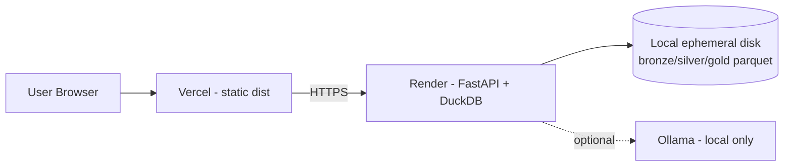
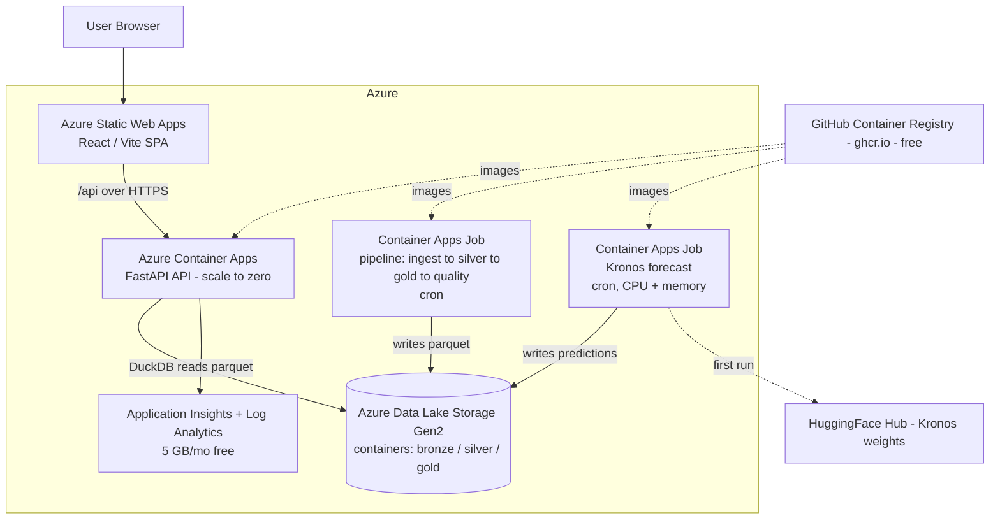

# Crypto Lakehouse — App Overview & Azure Target Architecture

> Status: **design / pre-migration**. This document describes what the app is today and the
> proposed architecture for running it on Microsoft Azure. No Azure resources exist yet (an
> active subscription is still being set up). This is a planning artifact — not a deployment.

---

## 1. What the app is

**Crypto Lakehouse** is a local-first, "zero-paid-services" portfolio project that demonstrates
an end-to-end **medallion data lakehouse** for crypto market data, with an analytics API, a
React dashboard, a natural-language assistant, and an experimental **Kronos** price-forecasting
feature.

Core ideas:
- **Medallion architecture**: `bronze` (raw JSON) → `silver` (clean Parquet) → `gold` (analytics Parquet).
- **DuckDB over Parquet**: data is served by creating DuckDB views over Parquet files (no DB server).
- **Local-first / free**: today everything runs on a laptop or free PaaS tiers; market data is
  fetched from Binance public APIs (or generated synthetically when geo-blocked).

### Component inventory (today)

| Component | Tech | Role |
|-----------|------|------|
| Backend API | FastAPI + Uvicorn (Python 3.11+) | REST endpoints over DuckDB views |
| Data engine | DuckDB + Polars + PyArrow | Parquet transforms + query |
| Lakehouse | Parquet files on local filesystem (`data/lakehouse/{bronze,silver,gold}`) | Medallion storage |
| Pipeline | `app.core.polling` + `scripts/*` | ingest → silver → gold → quality (background loop or scripts) |
| Forecasting | **Kronos** (vendored, PyTorch) behind the optional `[predict]` extra | `gold/asset_price_predictions` |
| Assistant | Local LLM via **Ollama** (`qwen3:4b`) + template/SQL-guard | NL → SQL Q&A |
| Frontend | React 18 + Vite + Tailwind + Recharts + **lightweight-charts** | Candlestick dashboard + forecast overlay |

### Current deployment

- **Frontend → Vercel** (serves the pre-built `frontend/dist`; `VITE_API_URL` baked to the Render URL).
- **Backend → Render** (`crypto-lakehouse.onrender.com`); auto-deploys from `main`.
- **Data** lives on the backend host's **ephemeral** disk and is (re)generated by the polling pipeline.
- **Ollama** GPU service from `docker-compose.yml` (local only; not deployed).

**Pain points this migration addresses**
1. **Ephemeral data** — the lakehouse lives on container disk and is lost on redeploy/restart.
2. **No durable object store** — Parquet should live in real object storage.
3. **Forecasting is impractical in the current hosting** — torch is too heavy for the Render free tier.
4. **Containerization is incomplete** — `docker-compose.yml` references `Dockerfile.api` / `Dockerfile.frontend` that **do not exist** yet.

---

## 2. Target Azure architecture

The guiding principle is to keep the spirit of the project (cheap, mostly serverless, scale-to-zero)
while making the lakehouse **durable** and the forecasting **viable**.

### Service mapping

| Today | Azure target | Why |
|-------|--------------|-----|
| Vercel (static `dist`) | **Azure Static Web Apps** (Free tier) | Global CDN for the SPA; near 1:1 with Vercel; built-in env + linked-backend support |
| Render (FastAPI container) | **Azure Container Apps** (Consumption, scale-to-zero) | Same container model as Render; cheap; HTTPS ingress; revisions |
| Parquet on local disk | **Azure Data Lake Storage Gen2** (Blob + hierarchical namespace) | Durable, cheap object storage; DuckDB reads Parquet directly |
| In-process polling loop | **Container Apps Job** (scheduled/cron) | Decouples ingestion from the API; reliable schedule; writes to ADLS |
| `build_predictions.py` (torch) | **Container Apps Job** (CPU + larger memory, scheduled) | Keeps torch out of the API; runs Kronos on its own cadence |
| Ollama + Qwen (GPU, local) | **Template-matching tier only** (Azure OpenAI optional, off for free) | Keeps the assistant at $0; managed LLM can be added later if a small token spend is acceptable |
| (none) | **GitHub Container Registry (ghcr.io)** | Free for public images; Container Apps pulls from it — avoids ACR's ~$5/mo |
| `.env` secrets | **Container Apps secrets** + **Managed Identity** | Secretless access to ADLS/ghcr via MI; small secrets in the app's own secret store — avoids Key Vault cost |
| (none) | **Application Insights + Log Analytics** (5 GB/mo free) | Tracing, logs, metrics within the free ingestion grant |

### How the lakehouse becomes durable

The single most important change: **Parquet moves to ADLS Gen2**, and DuckDB reads it remotely.

- DuckDB's `azure` extension can read `az://<container>/path/*.parquet` using a Managed Identity
  or connection string — so `DuckDBRepo` keeps the same "views over Parquet" model, just pointed
  at ADLS instead of `data/lakehouse`.
- **Alternative / optimization:** mount ADLS (or Azure Files) into the Container App as a volume so
  DuckDB reads it as a local path (lowest code change; good if remote read latency matters).
- The pipeline and forecast **jobs write Parquet to ADLS**; the API only **reads**. This makes the
  API stateless and safe to scale to zero.

### Forecasting (Kronos)

- Runs as a **scheduled Container Apps Job** (CPU, generous memory; Kronos-small needs no GPU).
  It loads weights from HuggingFace (cached), reads recent silver from ADLS, writes
  `gold/asset_price_predictions` to ADLS — exactly what `scripts/build_predictions.py` does today.
- The API/overlay already degrade gracefully when predictions are absent, so this can land later.
- **Future scale option:** GPU on Container Apps (GPU workload profiles), AKS + KAITO, or Azure ML
  if larger Kronos variants or lower latency are needed.

---

## 3. Cross-cutting concerns

- **Identity & secrets:** user-assigned **Managed Identity** for ACA + jobs; RBAC to ADLS
  (`Storage Blob Data Contributor`). Images come from public **ghcr.io** (no registry auth). The few
  config values live in **Container Apps secrets** — no Key Vault, no secrets in code.
- **Networking:** public HTTPS ingress on ACA to start; optionally add a private VNet + private
  endpoints to ADLS/Key Vault later for a hardened posture.
- **Observability:** App Insights for request traces + the pipeline/forecast job runs; Log Analytics
  workspace as the backing store; alerts on job failures and API errors.
- **IaC & deploy:** **Bicep** driven by **`azd`** (Azure Developer CLI) for one-command
  `azd up`. An `azure.yaml` maps the API container, the SPA, and the jobs. CI/CD from `main`
  (GitHub Actions) mirrors today's push-to-deploy.
- **Region:** pick one with Container Apps + Azure OpenAI availability (e.g. **East US 2** or
  **Sweden Central**) — final choice is an open decision.

## 4. Free-tier configuration (target: ~$0/month)

The stack is deliberately chosen so a personal-scale deployment lives **within Azure's always-free
allowances**. Free basis per component:

| Service | Free basis | Stays free if… |
|---------|-----------|----------------|
| Static Web Apps | **Free tier** (100 GB egress/mo, SSL, custom domain) | always free |
| Container Apps (API) | **Free monthly grant**: ~180k vCPU-s + 360k GiB-s + 2M requests / subscription / month | low traffic **+ scale-to-zero** keeps usage under the grant |
| Container Apps Jobs (pipeline + Kronos) | same monthly grant | scheduled (e.g. daily/hourly) short runs stay well under the grant |
| ADLS Gen2 / Blob | **5 GB LRS hot + 20k read / 10k write ops free for 12 months** | lakehouse stays a few hundred MB (it does); ~pennies/mo after 12 months |
| Log Analytics / App Insights | **5 GB ingest/mo free**, 31-day retention | sampling on; low telemetry volume |
| Container images | **ghcr.io free** for public images | repo/images kept public |
| Secrets | **Container Apps secrets** (free) + Managed Identity | no Key Vault |
| Assistant | **template-matching tier** (no external LLM) | LLM fallback left off |
| Managed Identity, egress (first 100 GB/mo) | free | — |

**No genuinely-metered "always-on" component remains.** The only slivers that can ever bill are
Blob storage (pennies, free for the first 12 months) and Container Apps usage **beyond** the
monthly free grant — which a personal-scale, scale-to-zero app won't reach.

### Honest caveats (so "free" is real)

- **Trial vs. free account.** The **$200 / 30-day trial credit** is a buffer, not "free forever."
  After the trial you keep the **always-free** services and the **12-month-free** items (Blob).
  To run anything metered you must convert to **pay-as-you-go** — at which point the design above
  bills ~$0 but is **not a hard-guaranteed $0** (Azure has no automatic spend cap on PAYG).
- **Guardrails to enforce it:** (1) set an **Azure Budget with alerts** at e.g. $1 / $5 the moment
  the subscription exists; (2) keep the API at **min replicas = 0** (scale-to-zero); (3) run the
  jobs on a **schedule**, never a hot loop; (4) keep telemetry sampled.
- **The deliberate trade-down for free:** the LLM assistant runs template-only (no Azure OpenAI),
  and Kronos forecasting runs as a periodic CPU job (no GPU). Both can be upgraded later if a small
  spend becomes acceptable.
- **Exact allowances change over time** — verify against the current *Azure free services* page and
  the live subscription's pricing/budget tools before we provision.

## 5. Suggested migration phases

0. **Foundation** — Resource Group, ACR, ADLS Gen2 (bronze/silver/gold containers), Key Vault,
   Managed Identity, Log Analytics + App Insights. (Bicep/azd scaffold.)
1. **Containerize + deploy the API** — author `Dockerfile.api`, push to ACR, deploy to Container
   Apps, point `DuckDBRepo` at ADLS (extension or mounted volume).
2. **Frontend → Static Web Apps** — build with `VITE_API_URL` = the ACA URL; deploy `dist`.
3. **Pipeline as a scheduled Job** — move `run_pipeline_once` into an ACA Job writing to ADLS.
4. **Kronos forecast Job** — scheduled CPU job → `gold/asset_price_predictions` in ADLS.
5. **Assistant → Azure OpenAI** — swap the Ollama client for Azure OpenAI (keep template tier).
6. **Harden** — custom domain, alerts, optional VNet/private endpoints, CI/CD from `main`.

## 6. Open decisions

- **Azure region** (East US 2 vs Sweden Central vs nearest).
- **ADLS access pattern**: DuckDB `azure` extension vs mounted volume.
- **Assistant**: locked to **template-only** for the free build; revisit Azure OpenAI later only if a small per-token spend is acceptable.
- **IaC flavor**: Bicep + `azd` (recommended, Azure-native) vs Terraform.
- **Market data**: keep synthetic generation vs real Binance from an Azure egress IP.
- **Whether forecasting ships to cloud now or stays a local/scheduled-job feature initially.**
